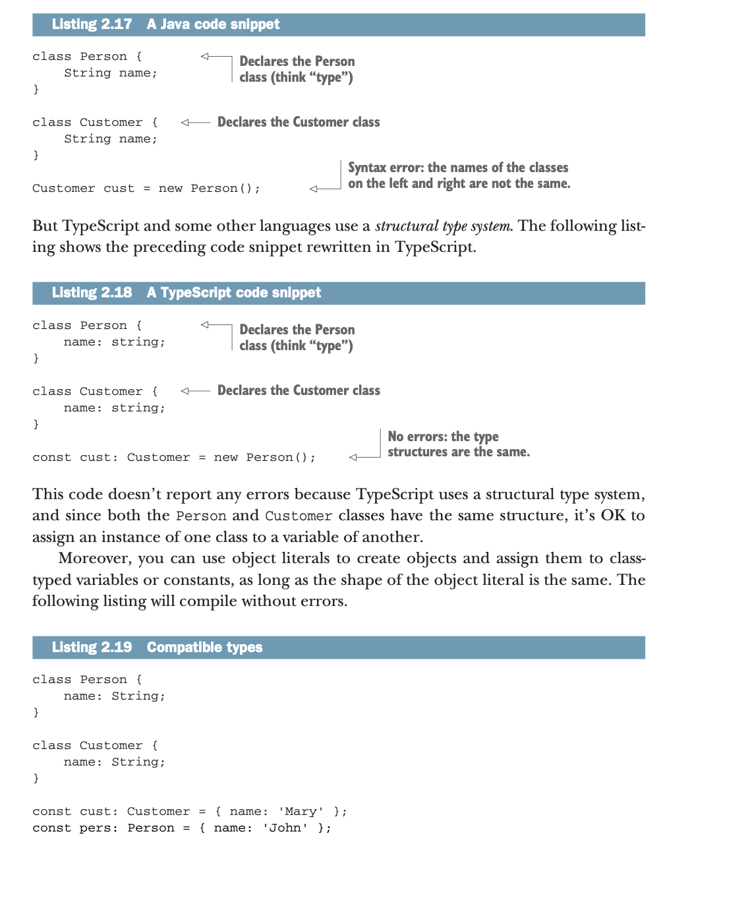
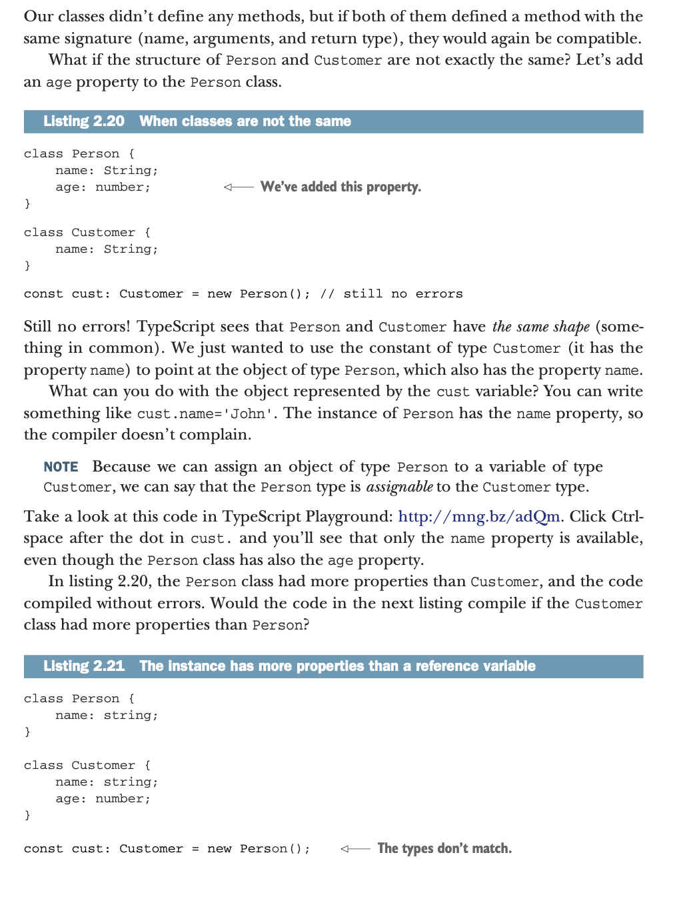
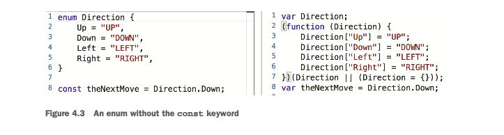
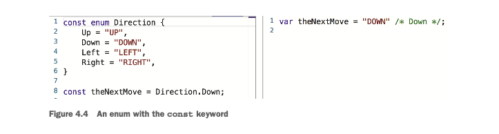

# typescript-101
tyspecript quickly book 101 resume and practices

TypeScript is great, but since it’s a compiled-to-JavaScript language

JavaScript is also a dynamically typed language, which gives additional freedom to software developers. There’s no need to declare an object’s properties up front, as the JavaScript engine will create the property at runtime if the object doesn’t already have it.

JavaScript is a very forgiving language, which is not a shortcoming if the codebase is small, and you’re the only person working on the project. Most likely, you’ll remember that x is supposed to be a number, and you don’t need any help with this.

To minimize the number of run- time errors, JavaScript developers write unit tests and perform code reviews.

Web developers needed a better language, but replacing JavaScript with another one that would be supported by all the different browsers was not realistic. Instead, new compile-to-JavaScript languages were created. They were more tool-friendly, but the program still had to be converted to JavaScript before deployment so every browser could support it.

## Part 1 - Mastering the typescript syntax

Explaining the benefits of TypeScript compared to Java- Script

You’ll see how to use built-in and declare custom types. We’ll introduce the use of classes and interfaces as well as generics, enums, decorators, mapped and conditional types

tooling used by Type- Script developers (such as compilers, linters, debuggers, and bundlers)

### getting familiar with typescript

### Why program in TypeScript

TypeScript is a compile-to-JavaScript language, which was released as an open source project by Microsoft in 2012.

A program written in TypeScript has to be transpiled into JavaScript first, and then it can be executed in the browser or a standalone JavaScript engine.

The difference between transpiling and compiling is that the latter turns the source code of a program into bytecode or machine code, whereas the former con- verts the program from one language to another, such as from TypeScript to Java- Script.

TypeScript is a superset of JavaScript, so you can take any JavaScript file, such as myProgram.js, change its file extension from .js to .ts, and myProgram.ts will likely become a valid TypeScript program. 

We say “likely” because the original JavaScript code may have hidden type-related bugs (it may dynamically change the types of object properties or add new ones after the object is declared) and other problems that will be revealed only after your JavaScript code is compiled.

In general, the word superset implies that the superset contains everything that the set has, plus something else

TypeScript as a superset of ECMAScript, which is a spec for all versions of JavaScript. ES.Next represents the very latest additions to ECMAScript that are still in the works.

Typescript contains ES.Next contains ES 3,5,6,7,8

In addition to the JavaScript set, TypeScript also supports static typing, whereas JavaScript supports only dynamic typing.
he word “typing” refers to assigning types to program variables.

In programming languages with static typing, a type must be assigned to a variable before you can use it. 

JavaScript, which doesn’t know about the types of your program variables until runtime. Even in the running program, you can change the type of a vari- able just by assigning it a value of a different type

```ts
let customerId: string;
customerId = 123;  // compile-time error
```


JavaScript decides on the variable type at runtime, and the type can be dynamically
changed, as in the following example:

```js
let customerId = "A15BN"; // OK, customerId is a string
customerId = 123;  // OK, from now on it's a number
```        

Now let’s consider a JavaScript function that applies a discount to a price. It has two arguments and both must be numbers.

```js
function getFinalPrice(price, discount) {
  return price - price / discount;
}
```

How do you know that the arguments must be numbers? First of all, you authored this function some time ago, and having an exceptional memory, you may just remember the types of all the arguments. Second, you used descriptive names for the arguments that hint at their types. Third, you can guess the types by reading the function code.
This is a pretty simple function, but let’s say someone invoked this function by pro- viding a discount as a string. This function would print NaN at runtime.

```js
console.log(getFinalPrice( 100, "10%")); // prints NaN
```

In typescript, this error is caught by the TypeScript static code analyzer while you type, even before you compile this code with the Typescript compiler (tsc). Moreover, if you specify the variable types, your editor or IDE will offer an autocomplete feature sug- gesting argument names and types for the getFinalPrice() function.

Use plaground on the typescript official page to code simple code snippet.

Typescript is used in angular, asp.net, react, others.

Some hard-core JavaScript developers say that TypeScript slows them down by requir- ing them to declare types, and that they’d be more productive in JavaScript. But remember that types in TypeScript are optional—you can continue writing in Java- Script but still introduce tsc in your workflow. Why? Because you’ll be able to use the latest ECMAScript syntax (such as async and await) and compile your JavaScript down to ES5 so your code can run in older browsers.

TypeScript gives you the benefits of statically typed languages when and where you want it, without stopping you from using the good old dynamic JavaScript objects when you want them

TypeScript stand out is that its cre- ators follow the ECMAScript standards and implement upcoming JavaScript features a lot faster than the vendors of web browsers.

In the summer of 2017, the async and await keywords (see section A.10.4 in the appendix) were included in ECMAScript specification ES2017 (a.k.a. ES8). It took more than a year for major browsers to start supporting these keywords, but Type- Script has supported them since November 2015

The best part is that you can use the future JavaScript syntax in today’s Type- Script code, and compile it down to the older JavaScript syntax (such as ES5) supported by all browsers!

ypeScript follows the latest specifications of ECMAScript and adds to them types, interfaces, decorators, class member variables (fields), generics, enums, the keywords public, protected, and private, and more.

the JavaScript code generated from TypeScript is easy to read, and it looks like hand- written code.

The core developer of TypeScript is Anders Hejlsberg, who also designed Turbo Pascal and Delphi and is the lead architect of C# at Microsoft.

At the end of 2014, Google approached Microsoft asking if they could intro- duce decorators in TypeScript so this language could be used for developing the Angular 2 framework. Microsoft agreed, and this gave a tremendous boost to TypeScript’s popularity, given that hundreds of thousands of develop- ers use Angular.

### Typical TypeScript workflows

But do you really want to stick to the ES5 version of JavaScript, ignoring all the latest syntax introduced by ES6, 7, 8, through to ES.Next? If not, you’ll have a compilation step in your workflow anyway—you’ll need to compile your source written in a newer Java- Script version into the well-supported ES5 syntax.

Developers don’t want to deploy so many files in the web server or a standalone JavaScript app, so we usually bundle these files (think “concatenate”) together.

JavaScript developers use different bundlers, like Webpack or Rollup, which not only concatenate multiple JavaScript files, but can optimize the code and remove unused code (performing tree-shaking). If your app consists of several modules, each module can be deployed as a separate bundle.

The JavaScript ecosystem includes thousands of libraries, which won’t be rewritten in TypeScript. The good news is that your app doesn’t have to be TypeScript-only, and it can use any of the existing JavaScript libraries.

If you just add the JavaScript library to your app, tsc(typescript compilerre) won’t help with autocomplete or error messages when you use the APIs of these libraries. But there are special type definition files with the extension .d.ts (covered in chapter 6), and if they’re present, tsc will show you errors and offer context-sensitive help for this library.


Includes the type definition file lodash.d.ts, which is used by tsc during development. It also includes the actual JavaScript library lodash.js, which will be bundled with the rest of your app during deployment.The term bundle refers to the pro- cess of combining several script files into one.


### Using the Typescript compiler

The compiler, tsc, can be bundled with your IDE of choice or can be installed as an IDE plugin, but we prefer to install it independently of an IDE by using the npm pack- age manager that comes with Node.js.

Node.js (or simply Node) isn’t just a framework or a library—it’s a JavaScript run- time environment as well. We use the Node runtime for running various utilities like npm or launching JavaScript code without a browser.

Using npm, you can install software either locally inside your project directory, or globally where it can be used across projects. We’ll use npm to install tsc and other packages from the npm repository located at www.npmjs.com, which hosts more than half a million packages.

```bash
npm install -g typescript
```

In real-world projects, however, we prefer to install tsc locally in the project directory by adding it in the devDependencies section of the project’s package.json. 

to check typescript compiler version
```bash
tsc -v
```

to compiler the main.ts file

```bash
tsc main
```

You may ask, “What’s the point of producing the JavaScript file if there’s a compilation error?” Well, from the JavaScript perspective, the content of the main.js file is valid. But in real-world TypeScript projects, we won’t want to allow code generation for erro- neous files.
tsc offers dozens of compilation options, described in the TypeScript documenta- tion (http://mng.bz/rf14), and one of them is noEmitOnError. 

```bash
tsc main --noEmitOnError true
```

The compiler’s --t option allows you to specify the target JavaScript syntax. For exam- ple, you can use the same source file and generate its JavaScript peer compliant with ES5, ES6, or newer syntax. Here’s how to compile the code to ES5-compatible syntax:

```bash
tsc --t ES5 main
```

If you have a tsconfig.json file in the proj- ect directory, you can just enter tsc on the command line, and the compiler will read all the options from tsconfig.json. A sample tsconfig.json file is shown here.

tsc allows you to preconfigure the process of compilation (specifying the source and destination directories, target, and so on). If you have a tsconfig.json file in the proj- ect directory, you can just enter tsc on the command line, and the compiler will read all the options from tsconfig.json. A sample tsconfig.json file is shown here.

```json
{
    "compilerOptions": {
        "baseUrl": "src",
        "outDir": "./dist",
        "noEmitOnError": true,
        "target": "es5",
        "watch": true
    }
}
```

The compiler’s target option is also used for syntax checking. For exam- ple, if you specify es3 as the compilation target, TypeScript will complain about the getter methods in your code. It simply doesn’t know how to com- pile getters into the ECMAScript 3 version of the language.

Note the last option, watch. The compiler will watch your typescript files, and when they change, tsc will recompile them.

for run the tsconfig.json

```bash
tsc
```

ctlr+c to exit the watch mode

To start a new TypeScript project, run the command tsc --init in any directory. It’ll create a tsconfig.json file for you with all the compiler’s options, most of which will be commented out. Uncomment them as needed.

```bash
tsc --init
```

A tsconfig.json file can inherit configurations from another file by using the extends property. 

### The REPL environment for TypeScript

REPL stands for Read-Evaluate-Print-Loop, and it refers to a simple interactive language shell that allows you to quickly execute a code fragment. 

### getting familiar with visual studio code

Integrated development environments (IDEs) and code editors increase developers’ productivity, and TypeScript is well supported by such tools: Visual Studio Code, Web- Storm, Eclipse, Sublime Text, Atom, Emacs, Vim.

VS Code is written in TypeScript.

On real-world projects, good context-sensitive help and support for refactoring are very important. Renaming all occurrences of a TypeScript variable or function name in statically typed languages can be done by IDEs in a split second, but this isn’t the case in JavaScript, which doesn’t support types.

VS Code supports two modes for TypeScript code: file scope and explicit project. The file scope is pretty limited, as it doesn’t allow a script in a file to use variables declared in another. The explicit project mode requires you to have a tsconfig.json file in the project directory.

If you’d like to be able to open VS Code from the command prompt, its executable will have to be added to the PATH environment variable on your computer. In Win- dows, the setup process should do it automatically. In macOS, start VS Code, select the View > Command Palette menu option, type shell command, and pick this option: Shell Command: Install ‘code’ Command in PATH. Then restart your terminal win- dow and enter code . from any directory. 

### extensions and features for vs code : 

* ESLint—Integrates the JavaScript linter and checks your code for readability and maintainability
* Prettier—Enforces a consistent style by parsing your code and reformatting it with its own rules
* Path Intellisense—Autocompletes file paths

In addition to syntax highlighting, TypeScript and JavaScript also provide semantic highlighting.

Syntax highlighting colors the text based on lexical rules. Semantic highlighting enriches the syntax coloring based on resolved symbol information from the language service.

IntelliSense shows you intelligent code completion, hover info, and signature information so that you can write code more quickly and correctly.

VS Code includes basic TypeScript snippets that are suggested as you type

VS Code's TypeScript IntelliSense understands many standard JSDoc annotations, and uses them to show typing information and documentation in suggestions, hover info, and signature help.

Hover over a TypeScript symbol to quickly see its type information and relevant documentation:

As you write a TypeScript function call, VS Code shows information about the function signature and highlights the parameter that you are currently completing:

Automatic imports speed up coding by helping you find available symbols and automatically adding imports for them.

VS Code includes a TypeScript formatter that providers basic code formatting with reasonable defaults.
Use the typescript.format.* settings to configure the built-in formatter, such as making braces appear on their own line

VS Code's TypeScript features also work with JSX. To use JSX in your TypeScript, use the *.tsx file extension instead of the normal *.ts

Press F2 to rename the symbol under the cursor across your TypeScript project

VS Code includes some handy refactorings for TypeScript such as Extract function and Extract constant. Just select the source code you'd like to extract and then click on the lightbulb in the gutter or press (⌘.) to see available refactorings.

Quick Fixes are suggested edits that address simple coding errors. Example Quick Fixes include:

* Adding a missing this to a member access.
* Fixing a misspelled property name.
* Removing unreachable code or unused imports
* Declaring

Unused TypeScript code, such as the else block of an if statement that is always true or an unreferenced import, is faded out in the editor:

The Organize Imports source code action sorts the imports in a TypeScript file and removes unused imports:

The editor.codeActionsOnSave setting lets you configure a set of Code Actions that are run when a file is saved. For example, you can enable organize imports on save by setting:

You can also set editor.codeActionsOnSave to an array of Code Actions to execute in order.

Here are some source actions:

* "organizeImports" - Enables organize imports on save.
*  "fixAll" - Auto Fix on Save computes all possible fixes in one round (for all providers including ESLint).
*  "fixAll.eslint" - Auto Fix only for ESLint.
*  "addMissingImports" - Adds all missing imports on save.

VS Code automatically suggests some common code simplifications such as converting a chain of .then calls on a promise to use async and await

Inlay hints add additional inline information to source code to help you understand what the code does.

The TypeScript references CodeLens displays an inline count of reference for classes, interfaces, methods, properties, and exported objects:

When you move or rename a file that is imported by other files in your TypeScript project, VS Code can automatically update all import paths that reference the moved file.

The typescript.updateImportsOnFileMove.enabled setting controls this behavior. Valid settings values are:

* "prompt" - The default. Asks if paths should be updated for each file move.
* "always" - Always automatically update paths.
* "never" - Do not update paths automatically and do not prompt.

VS Code comes with great debugging support for TypeScript, including support for sourcemaps. Set breakpoints, inspect objects, navigate the call stack, and execute code in the Debug Console. 


Debug client side

You can debug your client-side code using a browser debugger such as the built-in Edge and Chrome debugger, or the Debugger for Firefox.

Debug server side

Debug Node.js in VS Code using the built-in debugger. Setup is easy and there is a Node.js debugging tutorial to help you.


Linters provides warnings for suspicious looking code. While VS Code does not include a built-in TypeScript linter, TypeScript linter extensions available in the marketplace.

ESLint is a popular linter, which also supports TypeScript


There is an excellent online IDE called StackBlitz (https://stackblitz.com).
It’s powered by VS Code, but you don’t need to install it on your computer.


### Summary

* TypeScript is a superset of JavaScript. A program written in TypeScript has to be transpiled into JavaScript first, and then it can be executed in the browser or a standalone JavaScript engine.
* Errors are caught by the TypeScript static code analyzer as you type, even before you compile code with the Typescript compiler (tsc).
* TypeScript gives you the benefits of statically typed languages when and where you want it, without stopping you from using the good old dynamic JavaScript objects when you want them.
* TypeScript follows the latest specifications of ECMAScript and adds to them types, interfaces, decorators, class member variables (fields), generics, enums, the keywords public, protected, and private, and more. Check the Type- Script roadmap at https://github.com/Microsoft/TypeScript/wiki/Roadmap to see what’s available now and what’s coming in future releases of TypeScript.
* To start a new TypeScript project, run the command tsc --init in any direc- tory. It’ll create the tsconfig.json file for you, containing all the compiler’s options with most of them commented out. Uncomment them as needed.


## 2 Basic and custom types

* Declaring variables with types, and using types in function declarations
* Declaring type aliases with the type keyword
* Declaring custom types with classes and interfaces

You can think of TypeScript as JavaScript with types.

Although declaring types of identifiers before their use is highly recommended, it’s still optional.

### Declaring variables with types

Moreover, in JavaScript, you can assign a numeric value to a variable, and later assign a text value to that variable. This isn’t the case in TypeScript, where once the type is assigned to a variable, you can’t change its type

In typescript, We didn’t do it explicitly assign type, but since we initialized it with a numeric value, TypeScript assigns the type number to taxCode.

Although declaring variable types forces developers to write more code, their pro- ductivity increases in the long run because, more often than not, if a developer tries to assign a string value to a variable that already stores a number, it’s a mistake. It helps that the compiler can catch such errors during development rather than not discover- ing it until runtime.

A type can be assigned to a variable either explicitly by the software developer or implicitly (an inferred type) by the Typescript compiler

inferred type -> let taxCode = 1; 
explicit type -> let taxCode: number = 1;

### Basic type annotations

TypeScript offers the following type annotations:


* string — For textual data
* boolean — For true/false values
* number — For numeric values
* symbol — A unique value created by calling the Symbol constructor
* any — For variables that can hold values of various types, which may be unknown when you’re writing the code
* unknown — A counterpart of any, but no operations are permitted on an unknown without first asserting or narrowing it to a more specific type
* never — For representing unreachable code (we’ll provide an example shortly)
* void — An absence of a value

Starting with ECMAScript 2015, symbol is a primitive data type that is always unique and immutable. 
In the following code snippet, sym1 is not equal to sym2: 

```js
const sym1 = Symbol("orderID");
const sym2 = Symbol("orderID");
```


When you create a new symbol (note the absence of the new keyword), you can optionally provide its description, such as orderID. Symbols are typically used to create unique keys for object properties.

Symbols as object properties

```js
const ord = Symbol('orderID');

const myOrder = {
  ord: "123"
};

console.log(myOrder[ord]);
```

Being a superset of JavaScript, TypeScript also has two special values: null and undefined

You can assign null and undefined values to variables of any type, but more often they’re used in combination with values of other types.

The following code snippet shows how you can declare a function that returns either a string or a null value

```ts
function getName(): string | null {

}

```

As in most programming languages, if you declare a function that returns string, you can still return null, but being explicit about what a function can return increases code readability.

If you declare a variable of type any, you can assign any value to it, whether it’s numeric, textual, Boolean, or a custom type like Customer

You should avoid using the type any, because you’re losing the benefits of type checking, and the readability of your code suffers.

The never type is assigned to a function that never returns—one that either keeps running forever or that just throws an error. The arrow function in the next listing never returns, and the type checker will infer (guess) its return type as never.

```js
const logger = () => {
  while(true) {
    console.log("The server is up and running");
  }
}
```

In the preceding listing, the type assigned to logger is () => never. In listing 2.9 you’ll see another example where the never type is assigned.
The void type is not something you’d use in a variable declaration. It’s used to declare a function that doesn’t return a value:

```ts
function logError(errorMessage: string): void {
  console.error(errorMessage);
}
```

Unlike the never type, the void function does complete its execution, but it returns no value.

If a function body doesn’t have a return statement, it still returns a value of type undefined. The void type annotation can be used to prevent programmers from accidentally returning an explicit value from the function.

```ts
let name2: string = 'John Smith';
```

In terms of code style, specifying types is redundant here.

Although the second line is correct TypeScript syntax, specifying the type string is unnecessary, because the variable is initialized with the string and TypeScript will infer that the type of name2 is string.

You should avoid explicit type annotations where the Typescript compiler can infer them. 

TypeScript also allows you to use literals as types. The following line declares a variable of type John Smith.

```ts
let name3: 'John Smith';
```

We can say that the variable name3 has a literal type John Smith. The name3 variable will only allow one value, John Smith. Any attempt to assign another value to a vari- able of a literal type will result in a type checker error:

It’s not likely that you’ll be using string literals for declaring a type as shown in the name3 variable, but you may use string literals as types in unions (explained in section 2.1.3) and enums (explained in chapter 4).

Add explicit type annotations for function or methods signatures and public class members.


#### Type widening

If you declare a variable without initializing it with a specific value, TypeScript uses the internal types null or undefined, which are converted to any. This is called type widening.


The value of the following variable would be undefined.
let productId;
productId = null;
productId = undefined;


The Typescript compiler applies type widening and assigns the type any to null and undefined values. 

It’s worth mentioning that the Typescript compiler supports a --strictNullCheck option that prohibits the assignment of null to variables with known types

let productId = 123;
productId = null;  // compiler error
productId = undefined;  // compiler error


The --strictNullCheck option also helps in catching potentially undefined values. For example, a function may return an object with an optional property, and your code might wrongly assume that this property is there and try to apply a function on it.

TypeScript includes other types that are used in interactions with the web browser, such as HTMLElement and Document. Also, you can use the key- words type, class, and interface to declare your own types, such as Cus- tomer or Person. We’ll show how to do that in the next section. You’ll also see how you can combine types using unions.

Type annotations are used not only for declaring variable types, but also for declaring types of function arguments and their return values. We’ll discuss that next.

### Types in function declarations

TypeScript functions and function expressions are similar to JavaScript functions, but you can explicitly declare the types of arguments and return values.

calculating tax in js

```js
function calcTax(sate, income, dependents) {
  if(state === 'NY') {
    return income * 0.06 - dependents * 500;
  } else if(state === 'NJ') {
    return income * 0.05 -dependents * 300;
  }
}
```

- correct way of calling function
let tax = calcTax('NJ', 50000, 2);

- wrong way of calling function -> NAN(not a number)
let tax = calcTax('NJ', 50000, 'two');

```ts
function calcTax(satet: string. income: number, dependents: number) : number | undefined {
  if(state === 'NY') {
    return income * 0.06 - dependents * 500;
  } else if(state === 'NJ') {
    return income * 0.05 -dependents * 300;
  }
}
```

The Typescript compiler will display an error: “Argument of type string is not assign- able to parameter of type number.” Moreover, the return value of the function is declared as number, which stops you from making another mistake and assigning the result of the tax calculation to a non-numeric variable:

The compiler will catch this, producing the error “The type ‘number’ is not assignable to type ‘string’: var tax: string.” This kind of type-checking during compilation can save you a lot of time on any project.

This section has JavaScript and TypeScript versions of the calcTax() function, but they only process two states: NY and NJ. Invoking either of these functions for any other state will return undefined at runtime.
The Typescript compiler won’t warn you that the function in listing 2.5 is poorly written and may return undefined, but the TypeScript syntax allows you to warn the person who reads this code that the function in listing 2.5 may return not only a number but also an undefined value, if you invoke it with any other state but NY or NJ. You should change this function signature to declare such a use case as follows:

```ts
function calcTax(state: string, income: number, dependents: number) : number | undefined
```

### The union type

Unions allow you to express that a value can be one of several types. You can declare a custom type based on two or more existing types. For example, you can declare a vari- able of a type that can accept either a string value or a number (the vertical bar means union):

```ts
let padding: string | number;
```

Although the padding variable can store the value of either of the two specified types, at any given time it can be only of one type—either a string or a number.

TypeScript supports the type any, but the preceding declaration provides some benefits compared to the declaration let padding: any

```ts

function padLeft(value: string, padding: any ): string {
  if (typeof padding === "number") {
    return Array(padding + 1).join(" ") + value;
  }
  if (typeof padding === "string") { 
    return padding + value; 
  }
  throw new Error(`Expected string or number, got '${padding}'.`);
}

console.log( padLeft("Hello world", 4));
console.log( padLeft("Hello world", "John says "));
console.log( padLeft("Hello world", true));
```

### Type guards typeof and instanceof

An attempt to apply conditional statements to refine a variable’s type is called type narrowing. In the if statement in listing 2.6, we used the typeof type guard to nar- row the type of a variable that can store more than one TypeScript type. We used typeof to find out the actual type of padding at runtime.

Similarly, the instanceof type guard is used with custom types (with constructors), as will be explained in section 2.2. The instanceof guard allows you to check the actual object type at runtime:

```ts
if (person instanceof Person) {...}
```

The difference between typeof and instanceof is that the former is used with the built-in TypeScript types and the latter with the custom ones.

If we now change the type of padding to the union of string and number (as shown in the following listing), the compiler will report an error if you try to invoke padLeft() providing anything other than string or number. This will also eliminate the need to throw an exception.

```ts
function padLeft(value: string, padding: string | number ): string {
  if (typeof padding === "number") {
    return Array(padding + 1).join(" ") + value;
  }
  if (typeof padding === "string") {
    return padding + value;
  }
}
```

If you need to declare a variable that can hold values of more than one type, don’t use the type any; use a union such as let padding: string | number. Another choice is to declare two separate variables: let paddingStr: string; let paddingNum: number;.


Let’s modify the code in listing 2.8 to illustrate the type never by adding an else clause to the if statement. This next listing shows how the type checker will infer the never type for an impossible value.

else return padding, that blcok is never executed.

the never type of an impossible value
```ts
function padLeft(value: string, padding: string | number ): string {
  if (typeof padding === "number") {
    return Array(padding + 1).join(" ") + value;
  }
  if (typeof padding === "string") {
    return padding + value;
  } else {
    return padding;
  }
}
```

Since we declared in the function signature that the padding argument can be either string or number, any other value for padding is impossible. In other words, the else case is not possible, and the type checker will infer the type never for the padding vari- able in the else clause.

Another benefit of using the union type is that IDEs have an autocom- plete feature that will prompt you with allowed argument types, so you won’t even have the chance to make such a mistake.

If you use the union, the Typescript compiler will prevent incorrect invoca- tions of padLeft() by reporting an error at compile time.

We just used a union of primitive types (string and number), but in the next sec- tion you’ll see how to declare unions of custom types.

### Defining custom types

TypeScript allows you to create custom types with the type keyword, by declaring a class or an interface, or by declaring an enum (covered in chapter 4). Let’s get familiar with the type keyword first.

### Using the type keyword

The type keyword allows you to declare a new type or a type alias for an existing type. Let’s say your app deals with patients who are represented by their name, height, and weight. Both height and weight are numbers, but to improve the readability of your code, you can create aliases hinting at the units in which the height and weight are measured.

Declaring alias types Foot and Pound

You can create a new Patient type and use the preceding aliases in its declaration.

Declarations of type aliases don’t generate code in the compiled JavaScript. In Type- Script, declaring and initializing a variable of type Patient can look like the following.

```ts
type Foot = number;
type Pound = number;

type Patient = {
  name: string;
  hiehgt: Foot;
  weight: Pound;
}

let patient: Patient = {
    name: 'Joe Smith',
    height: 5,
    weight: 100
}
```

What if, while initializing the patient variable, you forget to specify the value of one
of the properties, such as weight?

TypeScript will complain:
"Type '{ name: string; height: number; }' is not assignable to type 'Patient'.
  Property 'weight' is missing in type '{ name: string; height: number; }'."

If you want to declare some of the properties as optional, you must add a question mark to their names. In the following type declaration, providing the value for the weight property is optional, and there won’t be any errors.

```ts
type Patient = {
    name: string;
    height: Height;
    weight?: Weight;
}

let patient: Patient = {
    name: 'Joe Smith',
    height: 5
}

```
You can use the question mark to define optional properties in classes or interfaces as well. 

You can also use the type keyword to declare a type alias for a function signature. Imagine you’re writing a framework that should allow you to create form controls and assign validator functions to them. A validator function must have a specific signature— it must accept an object of type FormControl and return either an object describing the errors of the form control value, or null if the value is valid. You can declare a new ValidatorFn type as follows:

```ts
type ValidatorFn = (c: FormControl) => { [key: string]: any }| null
```

Here, { [key: string]: any } means an object that can have properties of any type, but the key has to be either of type string or convertable to a string.

The constructor of the FormControl can have a parameter for the validator function, and it can use the custom ValidatorFn type as follows:


```ts
class FormControl {
    constructor (initialValue: string, validator: ValidatorFn | null) {...};
}
```

### Using classes as custom types

We assume you’re familiar with the JavaScript classes covered in the appendix. In this section we’ll start showing you additional features that TypeScript brings to JavaScript classes

JavaScript doesn’t offer any syntax for declaring class properties, but TypeScript does. In figure 2.2, on the left, you can see how we declared and instantiated a Person class that has three properties. The right side of figure 2.2 shows the ES6 version of this code produced by the Typescript compiler.


```ts
class Person {
  firstName: string;
  lastNmae: string;
  age: number;
}
```

As you can see, there are no properties in the JavaScript version of the Person class. Also, since the Person class didn’t declare a constructor, we had to initialize its proper- ties after instantiation. A constructor is a special function that’s executed once when the instance of a class is created.
Declaring a constructor with three arguments would allow you to instantiate the Person class and initialize its properties in one line. In TypeScript you can provide type annotations for a constructor’s arguments, but there’s more.
TypeScript offers the access level qualifiers public, private, and protected (cov- ered in chapter 3), and if you use any of them with the constructor arguments, the Typescript compiler will generate the code for adding these arguments as properties in the generated JavaScript object.


```ts
class PersonWithContructor {
    constructor(public firstName: string, public lastName: string, public age: number) {};
}
```

Now the code of the TypeScript class (on the left) is more concise, and the generated JavaScript code creates three properties in the constructor. Note line 6 in figure 2.3 on the left. We declared the constant without specifying its type, but we could rewrite this line explicitly specifying the type of p as follows:

```ts
const p: Person = new Person("John", "Smith", 25);
````

This would be an unnecessary use of an explicit type annotation. Since you declare a constant and immediately initialize it with an object of a known type (Person),

the TypeScript type checker can easily infer and assign the type to the constant p. The generated JavaScript code will look the same regardless of whether you specify the type of p or not.

 we used the public access level with each constructor argu- ment in the TypeScript class, which simply means that the generated corre- sponding properties can be accessed from any code located both inside and outside of the class.

 When you declare properties of a class, you can also mark them as readonly. Such properties can be initialized either at the declaration point or in the class constructor, and their values can’t be changed afterwards. The readonly qualifier is similar to the const keyword, but the latter can’t be used with class properties.


```ts
class block {
  readonly nonce: number;
  readonly hash: string;

  constructor (
    readonly index:  number,
    readonly previousHash: string,
    readonly timestamp: number,
    readonly data: string
  ) {
    this.nonce = nonce;
    this.hash = hash;
  }
}
```

The Block class includes six readonly properties. Note that we don’t need to explic- itly declare class properties for constructor arguments that have readonly, private, protected, or public qualifiers as we would in other object-oriented languages

### Using interfaces as custom types

Many object-oriented languages include a syntax construct called interface, which is used to enforce the implementation of specified properties or methods on an object.

JavaScript doesn’t support interfaces, but TypeScript does. In this section, we’ll show you how to use interfaces to declare custom types

TypeScript includes the keywords interface and implements to support inter- faces, but interfaces aren’t compiled into JavaScript code. They just help you to avoid using wrong types during development. Let’s get familiar with using the interface keyword to declare a custom type.

Suppose you want to write a function that can save information about people in some storage. This function should take an object that represents a person, and you want to ensure that it has specific properties of specific types. You can declare a Person interface as follows.

Declaring a custom type using an interface

```ts
interface Person {
  firstName: string;
  lastNmae: string;
  age: number;
}
```

 If you declare a custom type as class, you can use it as a value, meaning you can instantiate it using the new keyword

 Also, if you use the class keyword in the TypeScript code, it’ll have the corre- sponding code in generated JavaScript (a function in ES5, and a class in ES6). If you use the interface keyword, there won’t be any corresponding code in JavaScript, 


here is no mention of the interface on the right side of figure 2.4, and the JavaScript is more concise, which is good for any deployable code. But during development, the compiler will check that the object given as an argument to the savePerson() func- tion includes all the properties declared in the Person interface.

#### Which keyword to use: type, interface, or class?

e’ve shown you that a custom type can be declared using the keywords type,
class, or interface. Which of these keywords should you use for declaring a cus- tom type like Person?
If the custom type doesn’t need to be used for instantiating objects at runtime, use interface or type; otherwise use class. In other words, use class for creating a custom type if it should be used to represent a value.

```ts
interface Person {
  name: string;
}

function getP(p: Person){
    if (p instanceof Person){ // compile error
    }
}
```
The type checker will complain that Person only refers to a type but is being used as a value here.
If you are declaring a custom type just for the additional safety offered by TypeScript’s type checker, use type or interface. Neither interfaces nor types declared with the type keyword have representations in the emitted JavaScript code, which makes the runtime code smaller (bytewise). If you use classes for declaring types, they will have a footprint in the generated JavaScript.
Defining a custom type with the type keyword offers the same features as inter- face plus some extras. For example, you can’t use types declared as interfaces in unions or intersections. Also, in chapter 5, you’ll learn about conditional types, which can’t be declared using interfaces.

### Structural vs. nominal type systems


A primitive type has just a name (such as number), whereas a more complex type like an object or class has a name and some structure, represented by properties (for example, a Customer class likely has name and address properties).

How would you know if two types are the same or not? In Java (which uses a nomi- nal type system), two types are the same if they have the same names declared in the same namespace (a.k.a. packages). In a nominal type system, if you declare a variable of type Person, you can assign to it only an object of type Person or its descendant. In Java, the last line in the following listing won’t compile, because the names of the
classes are not the same, even though they have the same structure.




TIP - The access-level modifiers affect type compatibility. For example, if we declared the name property of the Person class as private, the code in listing 2.19 wouldn’t compile.



The code in listing 2.21 wouldn’t compile because the cust reference variable would point to a Person object that wouldn’t even allocate memory for the age property, and an assignment like cust.age = 29 wouldn’t be possible. This time, the Person type is not assignable to the Customer type.

TIP We’ll come back to TypeScript’s structural typing in section 4.2 when we discuss generics.

### Unions of custom types

union of custom types. Imagine an app that can perform various actions in response to the user’s activity. Each action is represented by a class with a different name. Each action must have a type and optionally may carry a pay- load, such as a search query.

2-22.ts

The code in listing 2.22 needs improvement, because just stating that each action must have a property describing its type is more of a JavaScript style of programming. In TypeScript, such a statement can be enforced pro- grammatically,

Discriminated unions include type members that have a common property—the discrim- inant. Depending on the value of the discriminant, you may want to perform different actions.

The union shown in listing 2.22 is an example of a discriminated union because each member has an actionType discriminant.


The in type guard

The in type guard acts as a narrowing expression for types. For example, if you have a function that can take an argument of a union type, you can check the actual type given during function invocation.
The following code shows two interfaces with different properties. The foo() function can take an object A or B as an argument. Using the in type guard, the foo() function can check if the provided object has a specific property before using it.

### The any and unknown types, and user-defined type guards


types any and unknown. In this sec- tion, we’ll show you the difference between them. You’ll also see how to write a cus- tom type guard, in addition to typeof, instanceof, and in.

Declaring a variable of any type allows you to assign it a value of any type. It’s like writing in JavaScript where you don’t specify a type
Similarly, trying to access a nonex- istent property on an object of any type may give unexpected results at runtime.

The unknown type was introduced in TypeScript 3.0. If you declare a variable of type unknown, the compiler will force you to narrow its type down before accessing its properties, sparing you from potential runtime surprises.

To illustrate the difference between any and unknown, let’s assume that we declared the Person type on the frontend, and it’s populated with data coming from the back- end in JSON format. To turn the JSON string into an object, we’ll use the method JSON.parse(), which returns any.

2.25

The last line will print undefined because we misspelled “address” in the JSON string. The parse method returns a JavaScript object that has an adress property, but not address on person1.


### A mini project

2-30.ts

Summary

* Although declaring variable types forces developers to write more code, their productivity increases in the long run.
* TypeScript offers a number of type annotations, but you can declare custom types as needed.
* You can create new types by declaring a union of existing ones.
* You can declare custom types using the type, interface, and class keywords. In chapter 4, you’ll see yet another way of declaring custom types with the enum keyword.
* TypeScript uses a structural type system as opposed to languages like Java or C#, which use a nominal type system.


## 3 - Object-oriented programming with classes and interfaces


* How class inheritance works
* Why and when to use abstract classes
* How interfaces can force a class to have methods with known signatures without worrying about implementation details
* What “programming to interfaces” means

OOP is a programming style where your programs focus on handling objects rather than on composing actions (think functions)

Developers who work with object-oriented languages use interfaces as a way to enforce certain APIs on classes.

in java ->  member variables is called in typescript as properties

* You can declare classes with properties, which in other object-oriented lan- guages are called member variables.
* As in JavaScript, classes may declare constructors, which are invoked once during instantiation.
* The Typescript compiler converts classes into JavaScript constructor functions if ES5 is specified as the compilation target syntax. If ES6 or later is specified as the target, TypeScript classes will be compiled into JavaScript classes.
* If a class constructor defines arguments that use such keywords as readonly, public, protected, or private, TypeScript creates class properties for each of the arguments.

in the class of typescript -> you can use readonly, public, protected or private

### Getting familiar with class inheritance

In real life, every person inherits some features from their parents. Similarly, in the TypeScript world, you can create a new class based on an existing one. For example, you can create a Person class with some properties, and then create an Employee class that will inherit all the properties of Person as well as declare additional ones.

In our example, the Employee class is a subclass of Person. Accordingly, the Person class is a superclass of Employee. You can also say that the Person class is an ancestor, and that Employee is a descendant of Person.

Under the hood, JavaScript supports prototypal object-based inheri- tance, where one object can be assigned to another object as its prototype— this happens at runtime. Once TypeScript code that uses inheritance is com- piled, the generated JavaScript code uses the syntax of prototypal inheritance.

In addition to properties, a class can include methods—this is how we call functions declared inside classes. And if a method is declared in a superclass, it will be inherited by the subclass unless the method was declared with the private access qualifier,

3-3.ts

### Access modifiers public, private, protected


private -> only can accesed by that class, not subclass can access. private only can used in the code by another variable or method, but cannot used on class instance.
protected -> subclass can have acces on code, but cannot useed on subclass instance.

Although protected class members are accessible from the descendant’s code, they are not accessible on the class instance. For example, the following code won’t com- pile and will give you the error, “Property ‘sayHello’ is protected and only accessible within class ‘Person’ and its subclasses.”

```ts
const empl = new Employee();
empl.sayHello(); // error
```

explicit or implicit declaration of class properties? There are argu- ments for both programming styles. Explicit declaration and initialization of class properties may increase the readability of the code, whereas implicit declaration makes the code of the TypeScript class more concise. But it doesn’t have to be an either-or decision. For example, you can declare public properties explicitly and pri- vate and protected ones implicitly. We generally use implicit declarations unless the property initialization involves some logic.

explicit declaration : 
```ts
class Person {
    public firstName ='';
    public lastName = '';
    private age = 0;

    constructor(firstName: string, lastName: string, age: number) {
        this.firstName = firstName;
        this.lastName = lastName;
        this.age = age;
    }
}
```

implicit declaration : 
```ts
class Person {
    constructor(public firstName: string, public lastName: string, private age: number) {}
}
```


### Static variables and a singleton example

In the ES6 version of JavaScript, when a property has to be shared by each instance of a class, we can declare it as static (see section A.9.3 in the appendix). Being a super- set of JavaScript, TypeScript also supports the static keyword. In this section we’ll look at a basic example, and then we’ll implement the singleton design pattern with the help of a static property and a private constructor.

Suppose a group of gangsters is on a mission (no worries—it’s just a game). We need to monitor the total number of bullets they have left. Every time a gangster shoots, this value has to be decreased by one. The total number of bullets should be known to each gangster.


3-1-3.ts

Both instances of the Gangsta class share the same totalBullets variable. That’s why no matter which gangster shoots, the shared totalBullets variable is updated.

Note that in the shoot() method we didn’t write this.totalBullets because this is not an instance variable. You access static class members by prepending their names with the class name, like Gangsta.totalBullets.

Static class members are not shared by subclasses. If you create a Super- Gangsta class that subclasses Gangsta, it will get its own copy of the total- Bullets property.

example :
```ts
class Gangsta {
    static totalBullets = 100;

    shoot() {
        Gangsta.totalBullets--;
        console.log(`[G] Bullets left: ${Gangsta.totalBullets}`);
    }
}

class SuperGangsta extends Gangsta {
    shootMany() {
        SuperGangsta.totalBullets--;
        SuperGangsta.totalBullets--;
        console.log(`[SG] Bullets left: ${SuperGangsta.totalBullets}`);
    }
}

const sg = new SuperGangsta();

sg.shootMany(); // prints 98
sg.shoot();     // prints 99
```

TIP -
Often we have several methods that perform similar actions. For exam- ple, we may need to write a dozen functions for validating user input in differ- ent UI fields. Instead of having separate functions, you can group them in a class with a dozen static methods.


Now let’s consider another example. Imagine you need to store important data in memory representing the current state of the app. Various scripts can access this stor- age, but you want to make sure that only one such object can be created for the entire app, also known as a single source of truth. Singleton is a popular design pattern that restricts the instantiation of a class to only one object.

How do you create a class that you can instantiate only once? It’s a trivial task in any object-oriented language that supports the private access qualifier. Basically, you need to write a class that won’t allow the new keyword to be used, because with new you can create as many instances as you want. The idea is simple—if a class has a private constructor, the new operator will fail.

How can you create even a single instance of such a class? If the class constructor is private, you can access it only within the class, and as the author of this class, you’ll responsibly create it only once by invoking the new operator from the class method.
But can you invoke a method on a class that hasn’t been instantiated? You can do it by making the class method static, so it doesn’t belong to any particular object instance and belongs to the class.

Listing 3.2 shows our implementation of the singleton design pattern in an AppState class, which has a counter property. Let’s assume that the counter rep- resents our app state, and it may be updated by multiple scripts in the app. This single instance of AppState should be the only place that stores the value of counter. Any script that needs to know the latest value of counter will get it from this AppState instance.

singleton.class
3-2.ts

### The super() method and the super keyword


Let’s continue looking into class inheritance. In figure 3.3 in line 15, we invoked the sayHello() method, which was declared in the superclass. What if both the superclass and subclass have methods with the same names? What if both have constructors? Can we control which method is executed? If both the superclass and the subclass have constructors, the one from the subclass must invoke the constructor of the superclass using the super() method.

Now let’s consider the situation where both the superclass and subclass have meth- ods with the same names. If a method in a subclass wants to invoke a method with the same name that’s defined in the superclass, it needs to use the super keyword instead of this when referencing the superclass method.
Let’s say a Person class has a sellStock() method that connects to a stock exchange and sells the specified number of shares of the given stock. In the Employee class we’d like to reuse this functionality, but every time employees sell stocks, they must report it to a compliance department in the firm.
We can declare a sellStock() method on the Employee class, and this method will call sellStock() on Person, and then its own method reportToCompliance(), as shown in the following listing.

3-4.ts

With the help of the super keyword, we reused functionality from the method declared in the superclass and added new functionality as well.

### Abstract classes

If you add the abstract keyword to the class declaration, it can’t be instantiated. An abstract class may include both methods that are implemented as well as abstract ones that are only declared.

Why would you want to create a class that can’t be instantiated? You may want to delegate the implementation of some methods to its subclasses, and you want to make sure these methods will have specific signatures.

Let’s look at how abstract classes can be used. Suppose a company has employees and contractors, and we need to design classes to represent the workers of this com- pany. Any worker’s object should support the following methods:

* constructor(name: string)
* changeAddress(newAddress: string)  giveDayOff()
* promote(percent: number)
* increasePay(percent: number)

In this scenario, “promote” means giving one day off and raising the salary by the specified percent. 
The increasePay() method should raise the yearly salary for employees but increase the hourly rate for contractors.

Let’s work on this assignment. We’ll need to create the classes Employee and Con- tractor, which should have some common functionality. For example, changing addresses and giving days off should work the same way for contractors and employ- ees, but increasing their pay requires different implementations for these categories of workers.

Here’s the plan: we’ll create an abstractPerson class with two descendants: Employee and Contractor. The Person class will implement the methods change- Address(), giveDayOff(), and promote(). This class will also include a declaration of the abstract method increasePay(), which will be implemented (differently!) in the subclasses of Person, as shown in the following listing.

3-5.ts

When we have class A extends class B, this means that class B is more general and class A is more specific (for example, it adds more properties).

A more specific type is assignable to a more general one. That’s why you can declare a variable of type Person and assign to it an Employee or Contractor object.


The workers array is of type Person, which allows us to store the instances of descen-
dant objects there as well.

TIP 
Because the descendants of Person don’t declare their own constructors, the constructor of the ancestor will be invoked automatically when we instantiate Employee and Contractor. If any of the descendants declared its own constructor, we’d have to use super() to ensure that the constructor of Person was invoked.

The actual type of the object is evaluated only at runtime, which explains why the correct implementation of increasePay() is invoked on each object. This is an example of polymorphism—a feature that each object-oriented language supports.

Protected constructors

In section 3.1.3, we declared a private constructor to create a singleton—a class that can be instantiated only once. There’s some use for protected constructors as well. Say you need to declare a class that can’t be instantiated, but its subclasses can. You could declare a protected constructor in the superclass and invoke it using super() from the subclass constructor.

This mimics one of the features of abstract classes. But a class with a protected con- structor won’t let you declare abstract methods unless the class itself is declared as abstract.

### Method overloading


Object-oriented programming languages like Java and C# support method overloading, which means that a class can declare more than one method with the same name but with different arguments. For example, you can write two versions of the calculateTax() method—one with two arguments, such as the person’s income and number of depen- dents, and the other with one argument of type Customer that has all the required data about the person.

In strongly typed languages, the ability to overload methods, specifying the types of arguments and a return value, is important because you can’t just invoke a class method and provide an argument of an arbitrary type, and the number of arguments can be different. TypeScript, however, is a sugar coating for JavaScript, which allows you to invoke a function while passing more or fewer arguments than the function sig- nature declares. JavaScript won’t complain, and it doesn’t need to support function overloading. Of course, you may get a runtime error if the method doesn’t properly handle the provided object, but this would happen at runtime. TypeScript offers a syn- tax for explicitly declaring each allowed overloaded method signature, eliminating the runtime surprises.

```ts
class ProductService {

    getProducts() {
        console.log(`Getting all products`);
    }

    getProducts(id: number) { // error
        console.log(`Getting the product info for ${id}`);
    }
}

const prodService = new ProductService();
prodService.getProducts(123);
prodService.getProducts();
```


The Typescript compiler will give you an error, “Duplicate function implementation,” for the second getProduct() declaration

The syntax in the TypeScript code (on the left) is wrong, but the JavaScript syntax on the right is perfectly fine. The first version of the getProducts method (line 4) was replaced with the second one (line 7), so during runtime the JavaScript version of this script has only one version of getProducts(id).

TypeScript offers the syntax to specify method overloading. It comes down to declaring all allowed method signatures without
implementing these methods, followed by one implemented method.

3-9.ts

Note the question mark after the id argument in the implemented method. This question mark declares this argument as optional. If we didn’t make this argument optional, the compiler would give us the error “Overload signature is not compatible with function implementation.” In our code sample, this means that if we declared a no-argument getProducts() method signature, the method implementation should allow us to invoke this function without arguments.

TIP 
Omitting the first two declarations in listing 3.9 wouldn’t change this program’s behavior. These lines just help IDEs provide better autocomplete options for the getProducts() function.

Similarly, you can overload a method signature to indicate that it can not only have different arguments but return values of different types. Listing 3.10 shows a script with an overloaded getProducts() method, which can be invoked in two ways:

* Provide the product description and return an array of type Product. 
* Provide the product id and return a single object of type Product.

3-10.ts

The question is, why even declare overloaded signatures if you can simply imple- ment a single method using unions in argument types and return values? Method overloading helps the Typescript compiler to properly map the provided argument types to the types of the return values. When the overloaded method signatures are


declared, the TypeScript static analyzer will properly suggest possible ways of invoking the overloaded method. in vscode show the suggestion for methods

You may argue that the benefits offered by TypeScript’s method overloading are not too convincing, and we agree that it may be easier to just declare two methods with different names, such as getProduct() and getProducts(), without unionizing their argument and return types. This is true except for one use case: overloading constructors.

In TypeScript classes, there’s only one name you can give to a constructor, and that’s constructor. If you want to create a class with several constructors having different sig- natures, you may want to use the syntax for overloading,

```ts
class Product {
  id: number;
  description: string;
  constructor();
  constructor(id: number);
  constructor(id: number, description: string);
  constructor(id?: number, description?: string) {
    // Constructor implementation goes here  )
  }
}
```


But again, overloading constructors is not the only way to initialize an object’s proper- ties. For example, you could declare a single interface to represent all possible param- eters for a constructor. The following listing declares an interface with all optional properties and a class with one constructor that takes one optional argument.

A single constructor with an optional argument

3-12.ts

To summarize, use common sense when overloading a method or a constructor in TypeScript. Although overloading provides multiple ways of invoking a method, the logic may quickly become difficult to reason about. In our daily TypeScript work, we rarely use overloading.


### Working with interfaces

In chapter 2, we used TypeScript interfaces only for declaring custom types, and we came up with a general rule: if you need a custom type that includes a constructor, use a class; otherwise use an interface. In this section, we’ll show you how to use TypeScript interfaces to ensure that a class implements a specific API.


### Enforcing the contract

An interface can declare not only properties but also methods (no implementations though). A class declaration can then include the implements keyword followed by the name of the interface. In other words, while an interface just contains method sig- natures, a class can contain their implementations.

Say you own a Toyota Camry. It has thousands of parts that perform various actions, but as a driver you just need to know how to use a handful of controls—how to start and stop the engine, how to accelerate and brake, how to turn on the radio, and so on. All these controls together can be considered a public interface offered to you by the designers of the Toyota Camry.

Now imagine that you have to rent a car, and they give you a Ford Taurus, which you’ve never driven before. Will you know how to drive it? Yes, because it has a famil- iar interface: a key for starting the engine, acceleration and brake pedals, and so on. When you rent a car, you can even request a car that has a specific interface, such as an automatic transmission.

3-31.ts

Note that none of the methods of MotorVehicle are implemented. Now we can declare a Car class that will implement all the methods declared in the MotorVehicle interface. By using the keyword implements.

you must implement each and every method declared in the inter- face. In other words, the preceding code snippet states “I swear that the class Car will implement the API declared in the interface MotorVehicle.”

 We could also declare the car constant of type MotorVehicle, because our Car class
implements this custom type:
```ts
const car: MotorVehicle = new Car();
```

What’s the difference between these two declarations of the car constant? Let’s say a Car class implements eight methods: five of them come from the MotorVehicle inter- face and the others are some arbitrary methods. If the car constant is of type Car, you can invoke all eight methods on the instance of the object represented by car. But if the type of car is MotorVehicle, only the five methods declared in this interface can be invoked using the car constant.

We can say that an interface enforces a specific contract. 

### Extending interfaces

But when you design a special car for the secret service, you may want to imple- ment all the methods in the MotorVehicle interface differently as well, so you may want to declare the SecretServiceCar class as follows.

```ts
class SecretServiceCar implements MotorVehicle, Flyable, Swimmable { 
  // Implement all the methods from three interfaces here
}
```

On the other hand, our flyable object is a motor vehicle as well, so we could declare the Flyable interface as follows.

Now, if a class includes implements Flyable in its declaration, it must implement the five methods declared in the MotorVehicle interface (see listing 3.13) as well as two methods from Flyable (listing 3.19)


3-20.ts

Declaring interfaces that include method signatures improves code readability because any interface describes a well-defined set of features that can be implemented by one or more concrete classes.

However, the interface won’t tell you exactly how a class will implement it. Devel- opers who practice the object-oriented approach in programming have a mantra: “Program to interfaces, not implementations.”

### Programming to interfaces

To understand the meaning and benefits of programming to interfaces, let’s consider a case where this technique wasn’t used. Imagine you had to write code that would retrieve information about all products or one product from a data source.

You know how to write classes, so you could start implementing them right away. You could define a custom Product type and a ProductService class with two methods.

3-21.ts

Then, in multiple places in your app, you could instantiate ProductService and use its methods:

That was easy, wasn’t it? You proudly commit this code to the source code repository, but your manager says that the backend guys are delaying implementing the server that was supposed to provide data for your ProductService. He asks you to create another class, MockProductService, with the same API that could return hardcoded product data.

No problem. You write another implementation of the product service.

TIP 

You might need to create MockProductService not only because the backend guys are running late, but also for use in unit tests, in which you don’t use real services.

You’ve created two concrete implementations of the product service. Hopefully you didn’t make mistakes while declaring methods in MockProductService. They need to be exactly the same as in ProductService or you may break the code that uses Mock- ProductService.

We already know that an interface allows us to enforce a contract upon a class—upon MockProductService in this case. But we didn’t declare any interface here!

It sounds weird, but in TypeScript you can declare a class that implements another class. The better (not the best) approach would be to start writing MockProductService as follows:


```ts
class MockProductService implements ProductService {
  // implementation goes here
}
```

TypeScript is smart enough to understand that if you use a class name after the word implement, you want to use it as an interface and enforce the implementation of all public methods of ProductService. This way, there’s no chance that you’ll forget to implement something, or make a mistake in the signature of getProducts() or get- ProductById(). Your code won’t compile until you properly implement these meth- ods in the MockProductService class.


But the best approach is to program to interfaces from the very beginning. When you got the requirement to write ProductService with two methods, you should have started by declaring an interface with these methods, without worrying about their implementation.
Let’s call this interface IProductService and declare two method signatures there. Then declare a ProductService class that implements this interface.


Declaring an API as an interface shows that you spent time thinking about the required functionality, and only afterwards took care of the concrete implementation. Now, if a new class, such as MockProductService, has to be implemented, you’d start it like this:

Use the interface keyword instead of class if you don’t need to instan- tiate this custom type (for example, Product), and the JavaScript footprint will be smaller

TIP 
We named the interface IProductService, starting with a capital I, whereas the class name was ProductService. Some people prefer using the suffix Impl for concrete implementations, such as ProductServiceImpl, and to simply name the interface ProductService.

Another good example of programming to interfaces is factory functions, which imple- ment some business logic and then return the proper instance of the object. If we had to write a factory function that returned either ProductService or MockProduct- Service, we’d use the interface as its return type.

In this example, we used the isProd constant with a hardcoded value of true. In real- world apps, this value would be obtained from a property file or environment variable.

By changing this property from true to false, we can change the behavior of the app at runtime.

Although the actual type of the returned object will be either ProductService or MockProductService, we used an IProductService abstraction in the function signa- ture. This makes our factory function more flexible and easily expandable: if in the future we need to modify this function’s body to return an object of the type Another- ProductService, we can just make sure that this new class declaration includes implements IProductService, and the code that uses our factory function will com- pile without any additional changes. Program to interfaces!

while explaining the specifics of using dependency injection with the Angular framework, we’ll come back to the idea of pro- gramming to abstractions. There you’ll see that TypeScript interfaces can’t be used, but you could use abstract classes instead.


Summary

* You can create a class using another one as a base. We call this class inheritance.
* A subclass can use public or protected properties of a superclass.
* If a class property is declared as private, it can be used only within that class.
* You can create a class that can only be instantiated once by using a private
constructor.
* If methods with the same signatures exist in the superclass and a subclass, we
call it method overriding. Class constructors can be overridden as well. The super keyword and the super() method allow a subclass to invoke the class members of a superclass.
* You can declare several signatures for a method, and this is called method overloading.
* Interfaces can include method signatures but can’t contain their implementa- tions.
* You can inherit one interface from another.
* While implementing a class, see if any methods can be declared in a separate interface. Then your class will have to implement that interface. This approach provides a clean way to separate the declaration of functionality from the implementation.

## 4 - Using enums and generics

* The benefits of using enums
* The syntax for numeric and string enums
* What generic types are for
* How to write classes, interfaces, and functions that support generics

In chapter 2, we introduced unions, which allow you to create a custom type by combining several existing types. In this chapter, you’ll learn how to use enums—a way to create a new type based on a limited set of values.

We’ll also introduce generics, which allow you to place type constraints on class members, function parameters, or their return types.


### Using enums

Enumerations (a.k.a. enums) allow you to create limited sets of named constants that have something in common. Such constants can be numbers or strings.

### Numeric enums

A week has seven days, and you can assign the numbers 1 to 7 to represent them. But what’s the first day of the week?

According to ISO 8601, the standard on data elements and interchange formats, Monday is the first day of the week, which doesn’t stop such countries as USA, Can- ada, and Australia from considering Sunday to be the first day of the week. Also, what if someone assigned the number 8 to the variable that stores the day? We don’t want this to happen, and using day names instead of numbers makes our code more read- able. Using just the numbers 1 to 7 to represent days may not be a good idea. On the other hand, using numbers to store days is more efficient than using names. We want readability, the ability to restrict values to a limited set, and efficiency in storing data. This is where enums can help.

TypeScript has an enum keyword that can define a limited set of constants. We can declare a new type for weekdays as follows.

4-1.ts

This listing defines a new type, Weekdays, that has a limited number of values. We ini- tialized each enum member with a numeric value, and days of the week can be referred to using dot notation.

Using the members of the Weekdays enum stops you from making a mistake and assigning a wrong value (such as 8) to the variable dayOff.


we could have initialized only Monday with 1, and the rest of the days values would be assigned using auto-increment: Tuesday would be initialized with 2, Wednesday with 3, and so on.

By default, enums are zero-based, so if we didn’t initialize the Monday member with 1, its value would be 0.

Reversing numeric enums

If you know the value of a numeric enum, you can find the name of that enum mem- ber. For example, you might have a function that returns the weekday number, and you’d like to print its name. By using this value as an index, you can retrieve the name of the day.

```ts
console.log(Weekdays[3]);
```


The function in listing 4.3 converts the value from Celsius to Fahrenheit if you pass any value for fromTo except FtoC. In the last line, we purposely provided the errone- ous value ABCD as the fromTo parameter, and the function still converted the tempera- ture from Celsius to Fahrenheit.

Attempts to invoke a function with erroneous values should be caught by the compiler, and this is what TypeScript enums are for.
In the following listing, we declare a Direction enum that restricts the allowed constants to either FtoC or CtoF and nothing else. We also changed the type of the fromTo parameter from string to Direction.

ince the type of the second parameter of the function is Direction, we must invoke this function providing one of this enum’s members, such as Direction.CtoF. We’re not interested in the numeric value of this member. The purpose of this enum is just to provide a limited set of constants: CtoF and FtoC. The IDE will prompt you with two possible values for the second parameter, and you won’t have a chance for a typo.

### String enums

In some cases, you may want to declare a limited set of string constants, and for this you can use string enums—enums whose members are initialized with string values.


When you declare a string enum, you must initialize each member. You might ask, “Why not just use a numeric enum here so TypeScript could automatically initialize its members with any numbers?” The reason is that in some cases you want to give mean- ingful values to enum members. For example, you’ll need to debug the program, and instead of seeing that the last move was 0, you’ll see that the last move was UP.

ext question you might ask is “Why declare the Direction enum if I can just declare four string constants with the values UP, DOWN, LEFT, and RIGHT?” You can, but suppose we have a function with the following signature:

```ts
move(where: string)
```

A developer could make a mistake (or a typo) and invoke this function as move("North"). But North is not a valid direction, so it’s safer to declare this function using the Direction enum:

You can use the union type as an alternative to enums. For example, the signature of the move() function could look like this:
```ts
function move(direction: 'Up' | 'Down' | 'Left' | 'Right') {  }
move('North'); // compilation error
```
Another alternative to enums is defining a custom type:
```ts
type Direction = 'Up' | 'Down' | 'Left' | 'Right';
function move(direction: Direction) {}
move('North'); // compilation error
```

enum, union or custom type(type) assure the compilation error when the input is not valid input.

Now let’s imagine that you need to keep track of the app’s state changes. The user can initiate a limited number of actions in each of the app’s views, and you want to log the actions taken in the Products view. Initially the app tries to load products, and this action can either succeed or fail. The user can also search for products. To represent the states of the Products view, you might declare a string enum.

When the user clicks on the button to load products, you can log the value of the ProductsActionTypes.Load member, which will log the text "Products Load All". If the products were not loaded successfully, you can log the value of ProductsActionTypes .LoadFailure, which will log the text "Products Load All Failure".


String enums can easily be mapped to string values coming from a server or database (order status, user role, and so on) with no additional coding, providing you with all the benefits of strong typing


### Using const enums

If you use the keyword const while declaring an enum, its values will be inlined and no JavaScript will be generated.





As you see, no JavaScript code for enum Direction was generated in figure 4.4. But the value of the enum member from the TypeScript code (Direction.Down) was inlined in the JavaScri

The earlier sidebar, “Reversing numeric enums,” includes a listing where we reversed the third member of the enum: Weekdays[3]. This isn’t possible with const enum as they are not represented in the generated JavaScript code.

Using const with enum results in more concise JavaScript, but keep in mind that because there is no JavaScript code to represent your enum, you may run into some limitations. For example, you won’t be able to retrieve a numeric enum member’s name with its value.
Overall, using enums increases the readability of your programs.

### Using generics

You know that TypeScript has built-in types, and you can create custom ones as well. But there’s more to it. Strange as it may sound, types can be parameterized—you can provide a type (not the value) as a parameter.

It’s easy to declare a function that takes parameters of specific concrete types, such as a number and a string:

```ts
function calctTax(income: number, state: string){...}
```

But TypeScript generics allow you to write functions that can work with a variety of types. In other words, you can declare a function that works with a generic type, and the concrete type can be specified later by the caller of the function.

In TypeScript, you can write generic functions, classes, or interfaces. A generic type can be represented by an arbitrary letter (or letters), such as T in Array<T>, and when you declare a specific array, you provide a concrete type in angle brackets, such as number:

```ts
let lotteryNumbers: Array<number>
```

you’ll learn how to use generic code written by someone else, as well as how to create your own classes, interfaces, and functions that can work with generic types.

### Understanding generics

A generic is a piece of code that can handle values of multiple types, which are speci- fied when this code is used (during a function invocation or class instantiation).
Let’s consider TypeScript arrays, which can be declared as follows:

* Specify the type of the array element followed by []: 
```ts
const someValues: number[];
```
* Use the generic Array followed by the type parameter in angle brackets: 
```ts
const someValues: Array<number>;
```

If all elements of the array have the same type, both declarations are equivalent but the first syntax is simpler to read. With the second syntax, the angle brackets represent a type parameter. You can instantiate this Array like any other while restricting the type of allowed values (to number in our example). A bit later, we’ll show you when declaring an array with a generic type is the better approach.

The next code snippet creates an array that will initially have ten objects of type Person, and the inferred type of the people variable is Person[].

```ts
class Person{ }
const people = new Array<Person>(10);
```

TypeScript arrays can hold objects of any type, but if you decide to use the generic Array type, you must specify which value types are allowed in the array, such as Array<Person>. By doing this, you place a constraint on this instance of the array. If you tried to add an object of a different type to this array, the Typescript compiler would generate an error. In another piece of code, you could use the array with a dif- ferent type parameter, such as Array<Customer>.

The following listing declares a Person class, its descendant Employee, and an Animal class. Then it instantiates each class and tries to store all these objects in the workers array using the generic array notation with the type parameter Array<Person>.

4-7.ts

In listing 4.7, the last line won’t compile because the workers array was declared with the type parameter Person, and Animal is not a Person. But the Employee class extends Person and is considered a subtype of Person, so you can use the Employee subtype anywhere the supertype Person is allowed.

So, by using a generic workers array with the parameter <Person>, we announce our plans to store only instances of the class Person or objects of compatible types there. 

using TypeScript generics helps you avoid errors related to using the wrong types.


Generic variance
The term generic variance relates to the rules for using subtypes and supertypes in any particular place in your program. For example, in Java, arrays are covariant, which means that you can use Employee[] (the subtype) where the array Person[] (the supertype) is allowed.

Because TypeScript supports structural typing, you can use either an Employee or any other object literal that’s compatible with the type Person where the Person type is expected. In other words, generic variance applies to objects that are structurally the same. Given the importance of anonymous types in JavaScript, an understanding of this is important for the optimal use of generics in Typescript.

TIP 

We used const (and not let) to declare the workers identifier in listing 4.7 because its value never changes. Adding new objects to the workers array doesn’t change the address of the array in memory, so the value of the workers identifier remains the same (i.e., immutable).

There is a caveat, though. Whereas Java and C# use a nominal type system, TypeScript uses a structural one

In a nominal type system, types are checked against their names, but in a structural system they’re defined by their structure. In languages with a nominal type system, the following line would always result in an error:

```ts
let person: Person = new Animal();
```

With a structural type system, as long as the structures of the types are similar, you may get away with assigning an object of one type to a variable of another

Moreover, you don’t even have to create a new instance of the Person, Employee, or Animal classes—you can use the syntax of object literals instead. Adding the follow- ing line to listing 4.8 is perfectly fine, because the structure of the object literal is com- patible with the structure of type Person:
```ts
workers[3] = { name: "Mary" };
```

NOTE 

The previous sentence may irritate savvy JavaScript developers who are accustomed to adding object properties like worker.breed without thinking twice. If the breed property doesn’t exist on the worker object, the JavaScript engine would simply create it, right? This works in dynamically typed code, but if you decide to use the benefits of static typing, you have to play by the rules.

Generics can be used in a variety of scenarios. For example, you can create a function that takes values of various types, but during its invocation you must specify a concrete type. To be able to use generic types with a class, an interface, or a function, the cre- ator of this class, interface, or function has to write them in a special way to support generic types.

When to use generic arrays

We started this section by showing two different ways of declaring an array of num- bers. Let’s take another example:

```ts
const values1: string[] = ["Mary", "Joe"];
const values2: Array<string> = ["Mary", "Joe"];
```

When all elements of the array have the same type, you can use the syntax used to declare values1—it’s easier to read and write. But if an array can store elements of different types, you can use generics to restrict the types allowed in the array.

For example, you may declare an array that allows only strings and numbers. In the following code snippet, the line that declares values3 will result in a compilation error because Boolean values are not allowed in this array.

```ts
const values3: Array<string | number> = ["Mary", 123, true]; // error
const values4: Array<string | number> = ["Joe", 123, 567]; // no errors
```

```ts
freeze<T>(o: T): T;
```
The <T> is a placeholder for a concrete type that must be provided by the application developer during the array’s declaration, as we did in listing 4.8. Type- Script requires you to declare a type parameter with Array, and whenever you add new elements to this array, the compiler will check that their type matches the type used in the declaration.

```ts
const workers: Array<Person>;
```

But because generics aren’t supported in JavaScript, you won’t see them in the code generated by the compiler—generics (and any other types) are erased. Using type parameters is just a safety net for developers at compile time.

You can see more generic T types in lines 1022 and 1026 in figure 4.5. When generic types are specified with function arguments, no angle brackets are needed— you’ll see this syntax in listing 4.9.

There’s no T type in TypeScript. The T here means the push() and pop() methods let you push or pop objects of the type provided during the array declaration. For example, in the following code snippet, we declared an array using the type Person as a replacement for T, and that’s why we can use the instance of Person as the argument of the push() method:

```ts
const workers: Array<Person>;
workers.push(new Person());
```
NOTE 
The letter T stands for type, which is intuitive, but any letter or word can be used when declaring a generic type. In a map, developers often use the letters K for key and V for value.


Seeing the T type in the API of the Array interface tells us that its creator enabled sup- port for generics. Even if you’re not planning to create your own generic types, it’s really important that you understand the syntax of generics when reading someone else’s code or TypeScript documentation.

### Creating your own generic types

You can create your own generic classes, interfaces, or functions. In this section, we’ll create a generic interface, but the explanations are applicable to creating generic classes as well.

Let’s say you have a Rectangle class and need to add the capability of comparing the sizes of two rectangles. If you didn’t adopt the concept of programming to inter- faces (introduced in section 3.2.3), you’d simply add a compareRectangles() method to the Rectangle class.

But armed with the concept of programming to interfaces, you think differently: “Today, I need to compare rectangles, and tomorrow they’ll ask me to compare other objects. I’ll play it smart and declare an interface with a compareTo() function. Then the Rectangle class, and any other class in the future, can implement this interface. The algorithms for comparing rectangles will be different than comparing, say, triangles, but at least they’ll have something in common, and the method signature of compareTo() will look the same.”

So you have an object of some type, and it needs a compareTo() method that will compare this object to another object of the same type. If this object is bigger than the other, compareTo() will return a positive number; if this object is smaller, it returns negative; if they are equal, it returns 0.

The compareTo() method can take any object as its argument, and the class that implements Comparator must include the appropriate comparison algorithm (such as for comparing the sizes of rectangles).
The following listing shows a partial implementation of Rectangle and Triangle classes that use the Comparator interface.

bad example
```ts
interface Comparator {
    compareTo(value: any): number;
}

class Rectangle implements Comparator {
    compareTo(value: any): number {
        // the algorithm for comparing rectangles goes here
        return 0;
    }
}

class Triangle implements Comparator {
    compareTo(value: any): number {
        // the algorithm for comparing triangles goes here
        return 1;
    }
}
```

If the developer had a good night’s sleep and a cup of double espresso, they’d create instances of two rectangles and then pass one of them to the compareTo() method of another:

```ts
rectangle1.compareTo(rectangle2);
```

But what if the coffee machine wasn’t working that morning? Our developer could make a mistake and try to compare a rectangle to a triangle.

```ts
rectangle1.compareTo(triangle1);
```

Triangle fits the any type of the compareTo() parameter, and the preceding code can result in a runtime error. To catch such an error at compile time, we could use a generic type (instead of any) to place a constraint on which types can be given to the compareTo() method:

```ts
interface Comparator<T> {
    compareTo(value: T): number;
}
```

It’s important that both the interface and the method use the generic type repre- sented by the same letter T. Now the Rectangle and Triangle classes can implement Comparator, specifying concrete types in angle brackets:

4-9.ts

Let’s say our developer tries to make the same mistake:

```ts
rectangle1.compareTo(triangle1);
```

The TypeScript code analyzer will underline triangle1 with a red squiggly line, reporting an error: “Argument of type ‘Triangle’ is not assignable to parameter of type ‘Rectangle’.” As you can see, using generic types lowers the dependency of your code quality on the coffee machine.

* If the area of the first rectangle (width multiplied by height) is bigger than that of the second, the first rectangle is bigger. Two rectangles may have the same areas.
* If the salary of the first programmer is higher than that of the second, the first one is richer. Two programmers may have the same salaries.


Default values of generic types

To use a generic type, you have to provide a concrete type. The following code won’t compile because we didn’t specify a concrete type parameter while using the type A:
```ts
class A <T> {
    value: T;
}
class B extends A { // Compile error
}
```
Adding the type any while using the class A would fix this error:
```ts
class B extends A <any> {
}
```
Another way to fix that error would be to specify a default parameter while declaring the generic type. The following code snippet will compile without any errors:
```ts
class A < T = any > {  // declaring default parameter type
    value: T;
}
class B extends A { // No errors
}
```
Instead of any, you can specify another dummy type: 
```ts
class A < T = {} > {  // declaring default parameter type
    value: T;
}
```

With this technique, you won’t need to specify a generic parameter when you use generic classes.

Of course, if you create your own generic types and can provide parameter defaults that make some business sense (not just any), do that by all means.

In this section, we’ve created a generic Comparator<T> interface. Now let’s see how we can create a generic function.


### Creating generic functions

We all know how to write a function that can take arguments of concrete types and return a value of a concrete type. This time around, we’ll write a generic function that can take parameters of multiple types.

But first, let’s consider a not-so-good solution where a function can take a parame- ter of the type any and return a value of the same type. The function in the following listing can log objects of different types and return the data that was logged.

bad example : 

```ts
function printMe(content: any): any {
    console.log(content);
    return content;
}

const a = printMe("Hello");

class Person{
  constructor(public name: string) { }
}

const b = printMe(new Person("Joe"));
```

This function works for various types of arguments, but TypeScript doesn’t remember the argument type the printMe() function was invoked with. If you hover your mouse over the variables a and b in your IDE, the TypeScript static analyzer will report the types of both variables as any.

If we care to know which types of arguments were used in the invocation of printMe(), we’d need to rewrite it as a generic function. The following listing shows the syntax for providing the generic type <T> for the function, its parameter, and the return value.

4-13.ts

In this version of the function, we declare the generic type for the function as <T> and the type of the parameter and return value as T. Now the types are preserved, and the type of the constant a is string and the type of b is Person. If later on in the script you need to use a and b, the TypeScript static analyzer (and compiler) will perform the proper type checking.

NOTE 

By using the same letter T for the function argument type and return type, we place a constraint ensuring that no matter what concrete type is used during invocation, the return type of this function will be the same.

Similarly, you could use generics in fat arrow function expressions. The code sample from listing 4.13 could be rewritten as follows.

The preceding code snippet may not look too convincing—it seems redundant to use <string> if it’s clear that “Hello” is a string. But this may not always be the case, as you’ll see in listing 4.17.

Let’s write another little script that will provide more illustration of using generics in a class and function. The following listing declares a class that can represent a pair: a key and a value. Both key and value can by represented by multiple types, so we smell generics here.

When you write a piece of code that introduces generic type parameters represented by letters (such as K and V), you can declare variables using these letters as if they were built-in TypeScript types. When you declare (and compile) a concrete Pair with spe- cific types for K and V, the K and V will be erased and replaced with the declared types.
Let’s write a more concise version of the Pair class, which has a constructor and automatically created key and values properties:

Now let’s write a generic function that can compare generic pairs.

During the invocation of the compare() function you’re allowed to specify two con- crete types, which should be the same as the types provided for its parameters—the Pair objects.

Listing 4.17 shows a working script that uses the generic Pair class as well as the generic compare() function. First we create and compare two Pair instances that use the number type for the key and string type for values. Then we compare another two Pair instances that use the string type for both key and value.

Please note that in the first invocation of compare(), we explicitly specified the con- crete parameters, and in the second invocation we didn’t:

```ts
compare<number, string>(p1, p2)
compare(p3, p4)
```

The first line is easier to reason about, as we can see what kinds of pairs p1 and p2 are. Besides, if you make a mistake and specify the wrong types, the compiler will catch it right away:

```ts
compare<string, string>(p1, p2) //compile error
```

he next script shows another example of the generic function. This time we’ll map the members of a string enumeration to the user roles returned by a function. Imagine that an authorization mechanism returns one of the following user roles: admin or manager. We want to use string enums and map the user roles to the corre-
sponding members of this enum.

First, we’ll declare a custom User type, Then we’ll create a string enum that lists a limited set of constants that can be used as
user roles.

Next, we’ll create a function that loads the object with a hardcoded user name and its role. In real-world apps, we’d make a request to some authorization server, supplying a user ID to get the user’s role, but for our purposes, returning a hardcoded object will suffice.


The following listing shows a generic function that returns the User and then maps the received user role to an action using the string enum.

4-18.ts

The script in listing 4.18 uses the User type during the invocation of loadUser(), and the generic type T declared as the return type of this function becomes the concrete type User. Note that the hardcoded object returned by this function has the same structure as the User interface.

### Enforcing the return type of higher-order functions

f a function can receive a function as an argument or return another function, we call it a higher-order function. In this section we’ll show you an example that enforces the return type of a higher-order function while allowing arguments of different types.

Let’s say we need to write a higher-order function that returns a function with the following signature:

```ts
(c: number) => number
```
This fat arrow function takes a number as an argument and returns a number. The higher-order function (we’ll use fat arrow notation) might look like this:

```ts
(someValue: number) => (multiplier: number) => someValue * multiplier;
```

We didn’t write the return statement after the first fat arrow because in single-line fat
arrow functions, return is implicit. The following listing shows the use of such a function.

4-19.ts


Now let’s make our task a bit more complex. We want to allow our higher-order func- tion to be called with arguments of different types, ensuring that it always returns a function with the same signature:
```ts
(c: number) => number
```

Let’s start by declaring a generic function that can take a generic type T but returns
the function (c: number) ? number:
```ts
type numFunc<T> = (arg: T) => (c: number) => number;
```

Now we can declare variables of type numFunc, and TypeScript will ensure that these
variables are functions of type (c: number) ? number.


The last line won’t compile because the signature of the returned function is (c: number) ? string, which can’t be assigned to the variable of type numFunc. 

Summary

* TypeScript has an enum keyword that can define a limited set of constants.
* TypeScript supports numeric and string enums.
* If you use the const keyword while declaring an enum, its values will be inlined and no JavaScript will be generated.
* A generic is a piece of code that can handle values of multiple types that are specified when the code is used.
* You can create your own generic classes, interfaces, and functions.

## 5 - decorators and advanced types